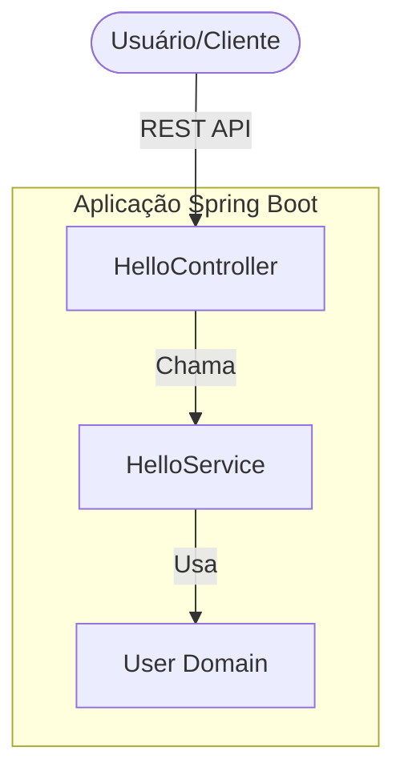

# Primeiro Projeto Spring Boot 🚀

Este projeto é um modelo profissional para uma aplicação Spring Boot, demonstrando as melhores práticas no desenvolvimento de APIs, conteinerização, testes automatizados e CI/CD.

## 🎯 Objetivo + Problema

**Problema:** Começar com Spring Boot pode ser desafiador ao tentar implementar padrões da indústria como Docker, pipelines de CI/CD e testes adequados desde o início.
**Objetivo:** Fornecer uma base robusta, segura e pronta para produção para desenvolvedores Spring Boot, apresentando uma arquitetura limpa e fluxos de trabalho automatizados.

## 🏗️ Arquitetura

A aplicação segue uma arquitetura em camadas para garantir a separação de responsabilidades e facilidade de manutenção.



## 🚀 Como Rodar

### Modo de Desenvolvimento (Maven Local)
1. Certifique-se de ter o **Java 21** e o **Maven** instalados.
2. Execute a aplicação:
   ```bash
   ./mvnw spring-boot:run
   ```
3. Acesse a API em: `http://localhost:8080/hello`
4. Acesse a documentação Swagger em: `http://localhost:8080/swagger-ui/index.html`

### Modo de Produção (Docker)
1. Certifique-se de ter o **Docker** e o **Docker Compose** instalados.
2. Build e execução:
   ```bash
   docker-compose up --build
   ```
3. A aplicação estará disponível em `http://localhost:8080`.

## 🛠️ Exemplos de API

### GET /hello
**Requisição:**
```bash
curl -X GET http://localhost:8080/hello
```
**Resposta:**
```text
Hello world, my name is Roberto
```

### POST /hello/{id}
**Requisição:**
```bash
curl -X POST "http://localhost:8080/hello/123?filter=premium" \
     -H "Content-Type: application/json" \
     -d '{"name": "Roberto", "email": "roberto@example.com"}'
```
**Resposta:**
```text
Hello Roberto Your email is roberto@example.com and your id is 123 and your filter is premium
```

## 🧪 Testes
O projeto inclui testes de unidade e integração. Execute-os usando:
```bash
./mvnw test
```

## ⛓️ CI/CD
Este projeto utiliza **GitHub Actions** para integração contínua. Cada push para a branch `main` dispara:
- Resolução de dependências e cache.
- Build completo do projeto.
- Execução de todos os testes automatizados.

---
Desenvolvido com ❤️ por Roberto utilizando Spring Boot.
